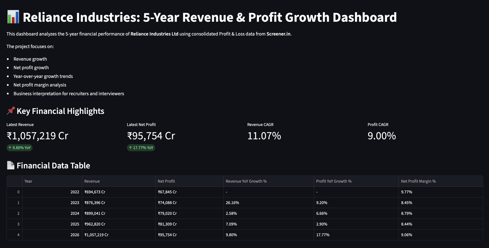
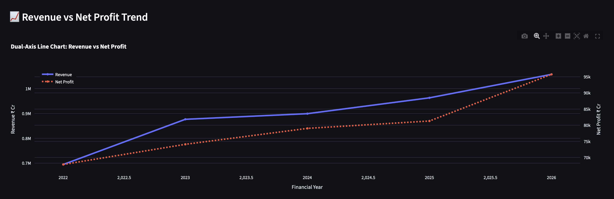
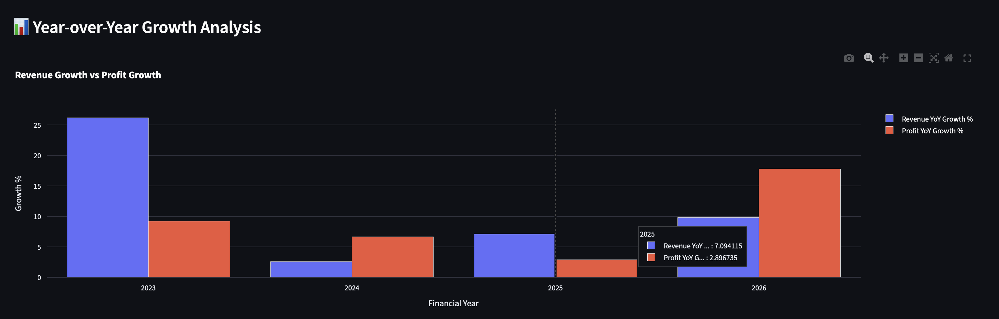
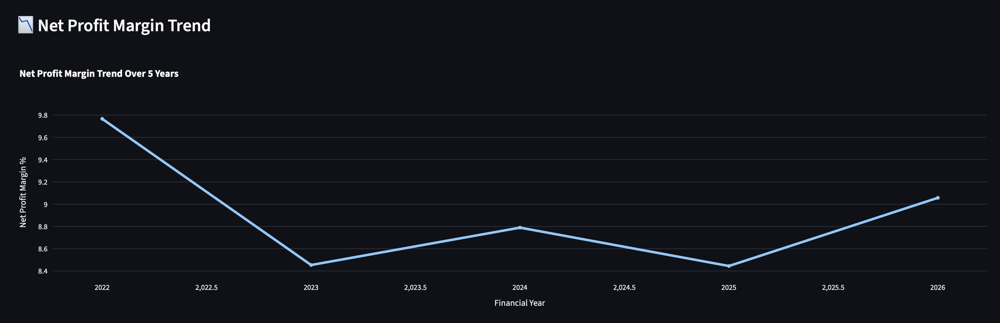

# Company Revenue & Profit Growth Dashboard

## Project Overview

This project is an interactive financial analytics dashboard built using Python, Pandas, Streamlit, and Plotly. It analyzes the 5-year financial performance of a listed company using financial data from Screener.in.

The dashboard provides insights into:

- Revenue trends
- Net profit trends
- Year-over-Year growth
- CAGR analysis
- Net profit margin analysis
- Automated business insights

## Features

- Dual-axis Revenue vs Profit chart
- YoY Growth comparison
- Margin trend analysis
- KPI cards
- Downloadable data
- Business interpretation section

## Tech Stack

- Python
- Pandas
- Streamlit
- Plotly

## Data Source

Screener.in

## Project Structure

company-financial-growth-dashboard/
│
├── revenue_growth.py
├── requirements.txt
├── README.md
└── screenshots/

## Screenshots

### Dashboard

### Revenue vs Profit

### Growth Analysis

### Margin Trend

